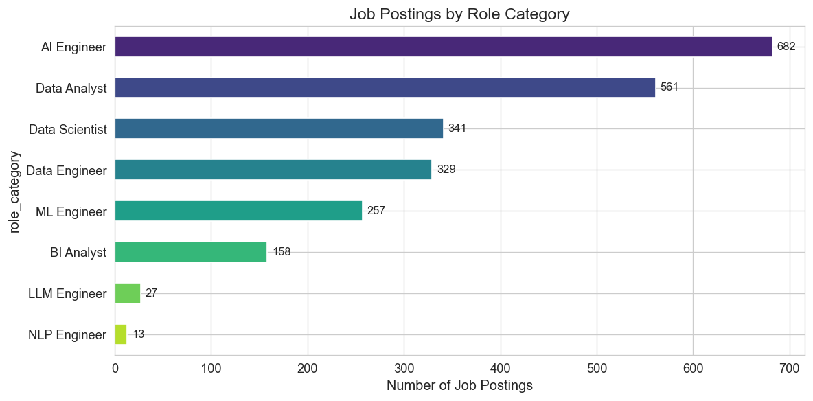
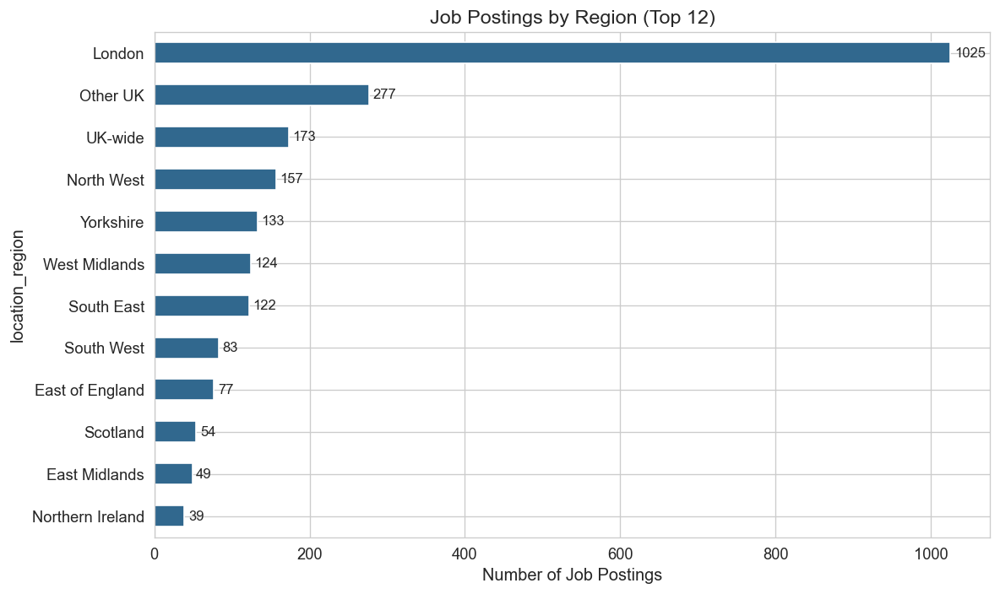
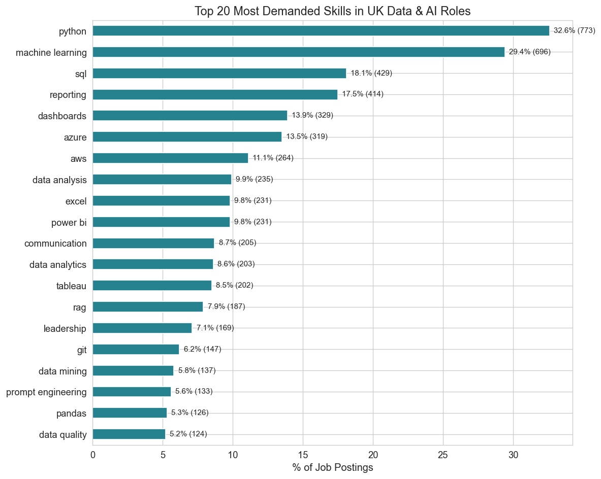
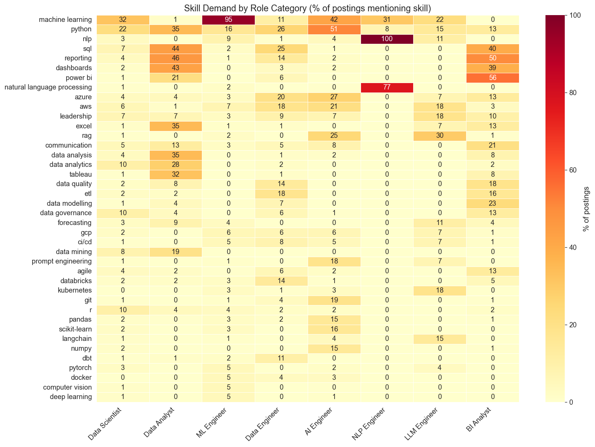

# 🔍 JobScope UK

## UK Job Market Intelligence Tool for Data & AI Roles

JobScope UK is a portfolio project that analyzes the UK job market for data and AI roles using real job postings collected from the Adzuna and Reed APIs. It combines a structured data pipeline, exploratory analysis, NLP-based skill extraction, and a Retrieval-Augmented Generation (RAG) interface that lets users ask natural-language questions grounded in actual job descriptions.

The project was designed to answer a practical question: **what skills, tools, and role patterns are employers in the UK really asking for across data and AI jobs?**

---

## Why I Built This

As someone applying into the UK data and AI market, I wanted to build a project around the market I am actually hiring into. Rather than relying on generic career advice, I wanted to analyze real postings, extract recurring skill patterns, compare role categories, and then build a grounded question-answering interface on top of the results.

This project demonstrates:

- data collection from external APIs
- data cleaning and normalization
- NLP / rule-based skill extraction
- EDA and storytelling with visualizations
- RAG architecture using Gemini + ChromaDB
- practical tradeoff handling around source quality, embeddings, and retrieval

---

## Dataset Summary

After cleaning and processing, the project produced:

- **2,368 cleaned job postings**
- **8 role categories**
- **35% salary coverage** with real salary data
- postings grouped by role category, seniority, region, extracted skills, and salary information where available

### Jobs by role category

- AI Engineer: 682
- Data Analyst: 561
- Data Scientist: 341
- Data Engineer: 329
- ML Engineer: 257
- BI Analyst: 158
- LLM Engineer: 27
- NLP Engineer: 13

### Jobs by seniority

- Mid: 1,251
- Junior: 592
- Senior: 525

### Top regions

- London: 1,025
- Other UK: 277
- UK-wide: 173
- North West: 157
- Yorkshire: 133
- West Midlands: 124
- South East: 122

---

## Tech Stack

- **Python** — core language
- **Adzuna API + Reed API** — data collection
- **SQLite** — raw and cleaned storage
- **Pandas** — transformation and analysis
- **Matplotlib / Seaborn** — visualization
- **Google Gemini** — embeddings and answer generation
- **ChromaDB** — vector store for semantic retrieval
- **Jupyter Notebook** — exploratory analysis
- **Streamlit** — optional app layer for interactive demo

---

## Architecture

The project is split into four main layers:

### 1. Data Collection
Job postings are collected from the Adzuna and Reed APIs across the target role categories and stored in a raw SQLite table.

### 2. Data Processing
Raw jobs are cleaned, normalized, deduplicated, and enriched. This includes:
- title normalization
- seniority inference
- location extraction
- salary midpoint calculation
- rule-based skill extraction using a curated taxonomy

### 3. Analysis
The cleaned dataset is analyzed to identify:
- role distribution
- regional concentration
- skill demand patterns
- salary variation
- skill co-occurrence
- differences across role categories

### 4. RAG Pipeline
A subset of high-quality job postings is embedded and indexed into ChromaDB. User questions are embedded with Gemini, semantically matched to the nearest postings, and then answered using Gemini generation grounded in retrieved job content.

---

## Repository Structure

```text
jobscope-uk/
├── data_collector.py
├── database.py
├── data_processor.py
├── fetch_full_descriptions.py
├── skill_taxonomy.py
├── rag_pipeline.py
├── analysis.ipynb
├── requirements.txt
├── env_example.txt
├── outputs/
│   ├── role_distribution.png
│   ├── seniority_distribution.png
│   ├── regional_distribution.png
│   ├── top_skills.png
│   ├── skills_by_role_heatmap.png
│   ├── skill_cooccurrence.png
│   ├── source_comparison.png
│   ├── salary_by_role.png
│   ├── salary_by_skill.png
│   ├── regional_skills.png
│   └── role_category_skills.png
└── README.md
```

---

## Key Findings

### 1. Python, machine learning, and SQL form the core technical foundation
Python is the most frequently mentioned technical skill in the dataset, followed closely by machine learning and SQL. Together, they form the strongest shared technical base across multiple data and AI role categories.

### 2. The market is not purely “advanced AI”
Although AI/ML tools appear strongly, the UK market still shows high demand for business-facing skills such as reporting, dashboards, Excel, Power BI, Tableau, and communication. This suggests that practical analytics remains a major part of the market.

### 3. Role titles have distinct skill fingerprints
Different roles show clear differences in expected tools and capabilities:
- **Data Analyst / BI Analyst** roles skew toward reporting, dashboards, SQL, Excel, Power BI, and Tableau
- **Data Scientist** roles emphasize Python, machine learning, SQL, and modeling libraries
- **Data Engineer** roles lean toward SQL, Python, ETL/ELT, cloud platforms, and data warehousing
- **AI / LLM-oriented roles** show stronger demand for GenAI frameworks, cloud AI services, and deployment tooling

### 4. London remains the main hiring hub
London dominates the dataset by volume and also shows a higher salary distribution than non-London roles in the disclosed-salary subset.

### 5. Mid-level roles dominate the market
The dataset is strongly skewed toward mid-level roles, with fewer junior and senior openings overall.

### 6. Source quality materially affects extraction
Reed has a seperate api that allows for full job descriptions unlike Adzuna descriptions that are capped at 500 characters, so for good skill extraction i had to limit to only reed jobs leading to richer skill extraction and better downstream retrieval quality for the RAG pipeline.

---

## Sample Visualizations

### Role distribution


### Regional distribution


### Top skills overall


### Skills by role category


More charts are available in the [`outputs/`](outputs) folder and the analysis notebook.

---

## RAG System

The RAG layer was built to allow natural-language questions over real job postings rather than relying on generic model knowledge.

### How it works

1. Cleaned job postings are converted into enriched text documents
2. Gemini embeddings are created for those documents
3. The embeddings and metadata are stored in **ChromaDB**
4. A user question is embedded
5. ChromaDB retrieves the nearest job postings
6. Gemini generates a grounded answer using the retrieved context

### Why ChromaDB
ChromaDB was used as the vector database because it provides:
- persistent local storage
- semantic similarity search
- metadata filtering
- a simple Python API for prototyping

### Practical note
For the first RAG version, indexing focused on **Reed postings** because they contained fuller descriptions than Adzuna postings, which led to better retrieval quality.

---

## Example RAG Questions and Answers

### 1. What do junior data analyst roles usually require?

**Answer:**  
Junior data analyst roles, particularly trainee positions, are designed for individuals with limited or no prior experience. These roles typically require strong attention to detail, organisation, analytical thinking, and good communication skills. Many postings also describe structured training pathways covering Excel, SQL, Python, Tableau, and entry-level certifications.

---

### 2. How do data engineer roles differ from data analyst roles?

**Answer:**  
Data Engineer roles focus more on modern data platform migration, data pipelines, cloud infrastructure, warehousing, and data quality. In contrast, Data Analyst roles emphasize reporting, dashboards, business-facing analysis, and foundational tooling such as Excel, SQL, Tableau, and Python.

---

### 3. What skills are common in data scientist roles?

**Answer:**  
Python is consistently required across retrieved data scientist postings, often alongside SQL, machine learning libraries, cloud platforms, modeling, and stakeholder-facing insight communication.

---

### 4. What tools are common in AI engineer jobs?

**Answer:**  
AI Engineer roles frequently mention Python, PyTorch, TensorFlow, Hugging Face, cloud platforms such as Azure, AWS, and GCP, and newer GenAI frameworks such as LangChain, LangGraph, and LlamaIndex. MLOps and deployment tools such as Docker and Kubernetes also appear regularly.

---

### 5. What is expected in senior data engineer roles?

**Answer:**  
Senior Data Engineer roles emphasize scalable architecture design, building and maintaining ETL/ELT pipelines, data quality, cloud infrastructure, CI/CD, observability, automation, and warehouse/platform reliability.

---

### 6. What is the salary range for senior data engineer roles?

**Answer:**  
Across the retrieved senior data engineer postings, the salary range is mainly around **£80,000–£90,000**, with one retrieved role around **£59,000–£66,000**.

---

### 7. What skills are common in London data scientist roles?

**Answer:**  
London data scientist roles commonly mention Python, SQL, machine learning libraries, AWS, model deployment, and communication with non-technical stakeholders.

---

## Example CLI Usage

### Index jobs into ChromaDB
```bash
./jbvenv/bin/python rag_pipeline.py --index --source reed --limit 100
```

### Ask a question
```bash
./jbvenv/bin/python rag_pipeline.py --ask "What tools are common in data engineer jobs?"
```

### Ask a filtered question
```bash
./jbvenv/bin/python rag_pipeline.py --ask "What do junior data analyst roles usually require?" --role "Data Analyst" --seniority junior
```

---

## Setup

### 1. Clone the repo
```bash
git clone https://github.com/Hab-eeb/jobscope-uk.git
cd jobscope-uk
```

### 2. Create and activate a virtual environment
```bash
python3 -m venv jbvenv
source jbvenv/bin/activate
```

### 3. Install requirements
```bash
./jbvenv/bin/python -m pip install -r requirements.txt
```

### 4. Create environment variables
Create a `.env` file based on `env_example.txt` and add your API keys.

Example:
```env
ADZUNA_APP_ID=your_id
ADZUNA_APP_KEY=your_key
REED_API_KEY=your_key
GEMINI_API_KEY=your_key
DB_NAME=jobscope.db
CHROMA_PATH=./data/chroma_db
COLLECTION_NAME=uk_jobs
```

### 5. Run the pipeline
```bash
python data_collector.py
python data_processor.py
python rag_pipeline.py --index --source reed
python rag_pipeline.py --ask "What skills are common in data scientist roles?"
```

---

## Limitations

- Salary coverage is incomplete, since many postings do not disclose salary
- Adzuna descriptions are often shorter than Reed descriptions, which affects skill extraction quality
- The current RAG pipeline is strongest on **qualitative, role-specific questions** rather than full-market aggregation questions
- Questions such as “most common role in London” or full statistical summaries are better handled by SQL / analysis logic than by vector retrieval alone

---

## Next Steps

- add a lightweight Streamlit interface
- combine vector retrieval with SQL-style analytical responses for aggregate questions
- improve document representations for even stronger retrieval quality
- expand README demo examples and deployment options

---

## What This Project Demonstrates

This project shows the ability to:
- build a multi-source data pipeline
- clean and normalize messy real-world job data
- extract structured information from unstructured text
- analyze labour-market patterns with narrative-driven EDA
- design and implement a practical RAG pipeline using modern tools
- make grounded engineering tradeoffs around retrieval quality and API limits

---

## Author

**Habeebullah Agbaje**

If you're reviewing this project as a recruiter, hiring manager, or collaborator, I’d be happy to walk through the architecture, the tradeoffs I made, and how I would extend this into a production-grade market intelligence tool.
